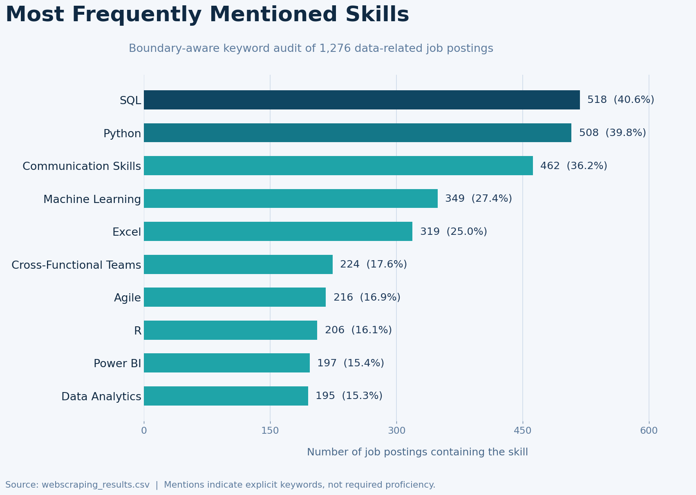
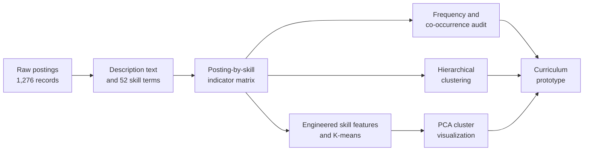
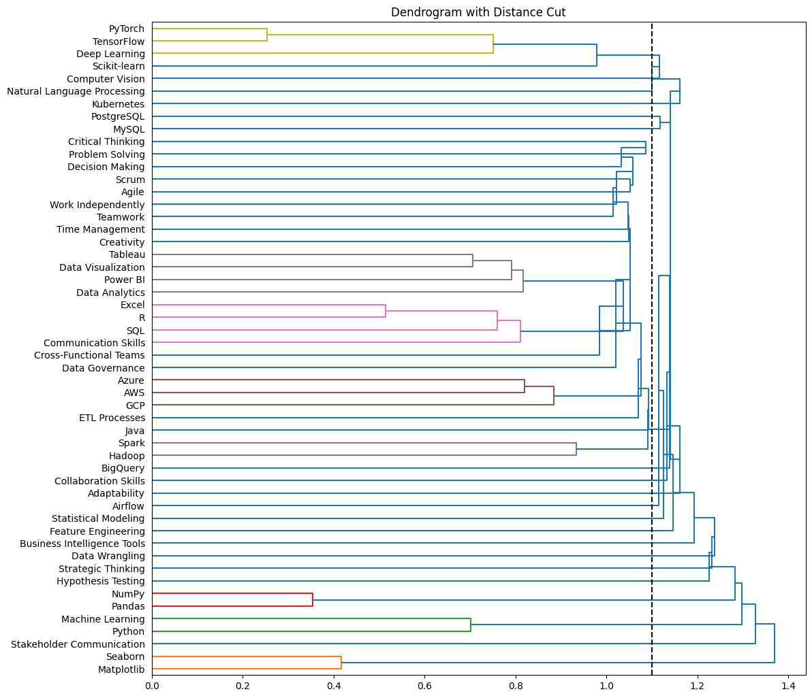

# Designing a Data Science Curriculum from Job-Market Signals

> An evidence-led curriculum design study using skills extracted from 1,276 Canadian and remote data-related job postings.

## Executive Summary

| Dimension | Description |
| --- | --- |
| Decision question | Which employer-mentioned skills should inform a coherent data science learning pathway? |
| Dataset | 1,276 scraped postings with job title, company, location, salary, description, and source-link fields |
| Analytical approach | Keyword feature engineering, exploratory analysis, co-occurrence analysis, hierarchical clustering, K-means, and PCA visualization |
| Deliverable | A manually interpreted ten-course curriculum prototype grounded in observed skill signals |
| Technology | Python, pandas, NumPy, SciPy, scikit-learn, Matplotlib, Seaborn, and Jupyter |

This project converts unstructured job descriptions into an interpretable skill matrix, examines demand and relationship patterns, and uses unsupervised learning to inform curriculum structure. The output is decision support for academic design, not a claim that market frequency alone determines what students should learn.

## Headline Findings

| Finding | Evidence from the audited sample | Design implication |
| --- | ---: | --- |
| Querying and programming are foundational signals | `SQL` appears in 518 postings (40.6%); `Python` in 508 (39.8%) | Begin with programming, querying, and data manipulation foundations |
| Communication is not secondary to technical work | `Communication Skills` appears in 462 postings (36.2%) | Integrate reporting and stakeholder practice across technical courses |
| Applied modeling has material demand | `Machine Learning` appears in 349 postings (27.4%) | Progress from statistics and feature work into modeling and applied AI |
| Business tooling remains visible | `Excel`, `Power BI`, and `Data Analytics` occur among high-frequency terms | Include analytics delivery and business intelligence in the pathway |

<p align="center">
  
</p>

**Metric definition.** The chart uses case-insensitive, boundary-aware matching for the project's predefined skill terms. A mention indicates that a keyword occurs in a description; it does not establish required proficiency, hiring importance, or causal labor-market demand.

## Analytical Workflow



## Methodology

| Stage | Implementation | Analytical output |
| --- | --- | --- |
| Data preparation | Load posting records and retain descriptive fields required for analysis | Auditable raw sample and data-quality profile |
| Skill extraction | Map descriptions to 52 predefined technical, analytical, business, and professional skill terms | Binary posting-by-skill matrix |
| Exploration | Aggregate mentions, locations, skill breadth, and skill co-occurrences | Demand signals and candidate skill relationships |
| Hierarchical clustering | Compare skill occurrence profiles using cosine-distance-based clustering | Dendrogram for exploratory module grouping |
| K-means profiling | Cluster engineered skill-level features and visualize in two dimensions with PCA | Alternative grouping lens for curriculum interpretation |
| Curriculum synthesis | Review statistical groupings and arrange skill areas into a teachable sequence | Ten-course curriculum prototype |

## Curriculum Prototype

The proposed sequence is deliberately curated after clustering: statistical similarity can reveal patterns, but prerequisites, learning progression, and responsible practice require human judgment.

| Course | Theme | Representative coverage |
| ---: | --- | --- |
| 1 | Programming and Query Foundations | Python, R, Java, SQL, pandas, NumPy |
| 2 | Analytics and Visualization | Data analytics, Matplotlib, Seaborn, Tableau, Power BI |
| 3 | Machine Learning Foundations | Machine learning, scikit-learn, deep learning, TensorFlow, PyTorch |
| 4 | Cloud and Large-Scale Data | Hadoop, Spark, Kubernetes, AWS, Azure, GCP, BigQuery |
| 5 | Data Engineering | ETL, Airflow, relational databases, data wrangling, feature engineering |
| 6 | Advanced Analytical Applications | NLP, computer vision, statistical modeling, hypothesis testing |
| 7 | Business Intelligence and Stakeholders | BI tooling, stakeholder communication, strategic thinking, collaboration |
| 8 | Analytical Problem Solving | Decision making, critical thinking, creativity, adaptability |
| 9 | Delivery and Team Practice | Cross-functional delivery, Agile, Scrum, teamwork, time management |
| 10 | Governance and Professional Practice | Data governance, independent work, ethical decision-making |

## Data Audit

The included source file is sufficiently complete for description-based skill exploration, but it is not a normalized labor-market panel.

| Quality check | Result |
| --- | ---: |
| Job-posting records | 1,276 |
| Source fields | 8 |
| Exact duplicate rows | 0 |
| Duplicate posting links | 0 |
| Missing job descriptions | 0 |
| Records with salary text | 252 (19.7%) |

| Most common location labels | Postings |
| --- | ---: |
| Toronto, ON | 141 |
| Remote | 127 |
| Hybrid work in Toronto, ON | 87 |
| Vancouver, BC | 44 |
| Montr&eacute;al, QC | 39 |

Locations are retained as scraped. Remote, hybrid, and city-level values therefore should not be aggregated into regional conclusions without additional standardization.

## Visual Evidence

The dendrogram documents the exploratory hierarchical-clustering stage and the selected distance cut used when reviewing possible skill groupings.

<p align="center">
  
</p>

The clustering output is a diagnostic input to curriculum design, not a validated course taxonomy.

## Repository Contents

| Path | Purpose |
| --- | --- |
| `DataScience_CurriculumDesign.ipynb` | Notebook containing extraction, exploration, clustering, PCA, and curriculum-design work |
| `webscraping_results.csv` | Raw job-posting records analyzed by the notebook |
| `dendrogram.png` | Full hierarchical-clustering dendrogram |
| `dendrogram_cut.png` | Dendrogram annotated with the selected distance threshold |
| `assets/project-banner.png` | Project header visual |
| `assets/top-skill-mentions.png` | Boundary-aware audit of the most frequently mentioned skills |

## Reproduce the Analysis

The notebook reads `webscraping_results.csv` from the repository root and writes `Processed_Job_Postings.csv` when the preprocessing/export cells are executed.

```bash
git clone https://github.com/JefferyLiu6/Data-Driven-Curriculum-Design-for-Data-Science.git
cd Data-Driven-Curriculum-Design-for-Data-Science
python -m venv .venv
source .venv/bin/activate
pip install jupyter pandas numpy scipy scikit-learn matplotlib seaborn
jupyter lab DataScience_CurriculumDesign.ipynb
```

The notebook contains inert, triple-quoted OpenAI example snippets for narrative experimentation; these are not required for the core analytical workflow and do not run during normal execution.

## Limitations and Improvements

| Limitation | Why it matters | Recommended improvement |
| --- | --- | --- |
| Notebook extraction uses raw substring matching; for example, `R` is flagged in all 1,276 saved descriptions while the boundary-aware README audit identifies 206. | Short terms can substantially inflate frequencies and distort clustering. | Replace extraction with validated boundary-aware patterns or a skill-entity matcher, then regenerate downstream outputs. |
| The hierarchical-clustering implementation supplies a square distance matrix to `linkage`, which produces a `ClusterWarning`. | The resulting hierarchy should not be treated as methodologically finalized. | Cluster from a condensed distance vector or validated feature matrix and assess stability across linkage choices. |
| Locations are unnormalized and salary text is available for only 252 records. | Geographic and compensation conclusions would be unreliable. | Normalize location and compensation fields and repeat collection across time periods. |
| Course structure includes manual interpretation after clustering. | The result is a reasoned prototype rather than an evaluated curriculum. | Validate with instructors, employers, and learner-outcome evidence. |

## Competencies Demonstrated

`Python` `pandas` `Text Feature Engineering` `Exploratory Data Analysis` `Data Visualization` `Hierarchical Clustering` `K-Means` `PCA` `Analytical Communication` `Responsible Interpretation`
